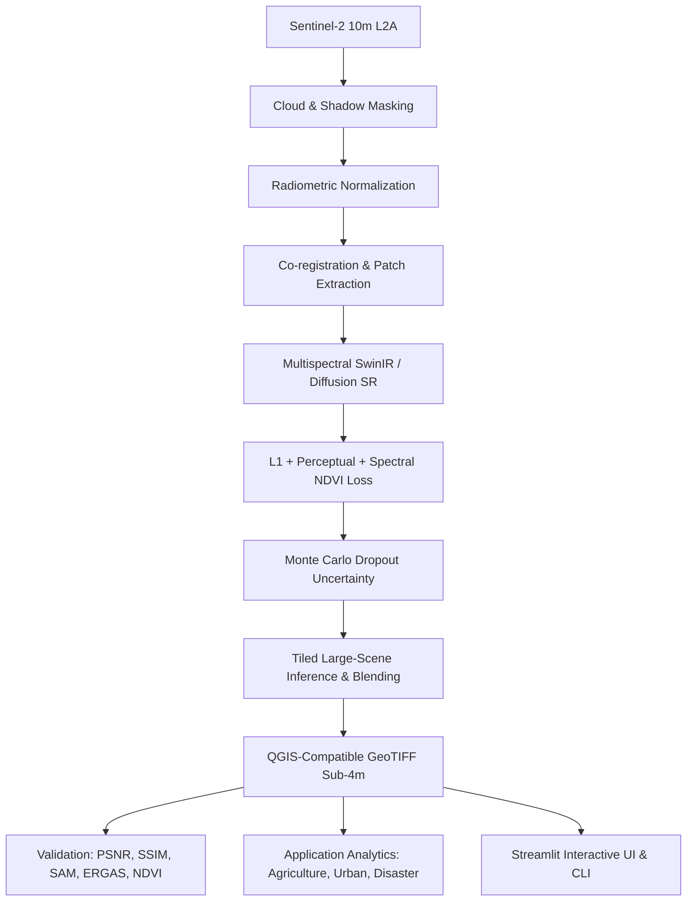

# Satellite-SRM: Deep Learning Based Super Resolution Mapping from Medium Resolution Satellite Imageries

**Problem Statement ID:** 26142  
**Organization:** National Technical Research Organisation (NTRO)  
**Theme:** Space Technology  
**Domain:** Satellite Super-Resolution Mapping (SRM)

---

## 1. Overview
Satellite-SRM is an end-to-end production-grade remote sensing and deep learning pipeline that ingests **10 m Sentinel-2 L2A multispectral imagery** (B02 Blue, B03 Green, B04 Red, B08 NIR) and reconstructs an enhanced **sub-4 m target-resolution geospatial product** (e.g. 2.5 m or 3.3 m GSD) while rigorously preserving:
- **Spatial geometric structure**
- **Spectral consistency** across all spectral bands (NDVI, band ratios)
- **Geographic metadata, projection, and Affine transform**
- **Quantified pixel-level uncertainty** via Monte Carlo Dropout



---

## 2. Key Features
1. **Multi-Band Super Resolution**: Explicitly processes 4 bands (B02, B03, B04, B08) rather than converting to RGB.
2. **Spectral Consistency Preservation**: Penalizes deviations in vegetation and moisture indices (NDVI, NIR/Red, NIR/Green) with differentiable loss formulations.
3. **Uncertainty Quantification**: Monte Carlo Dropout generates spatial uncertainty GeoTIFF maps, providing confidence intervals for intelligence and analysis.
4. **Tiled Large-Scene Inference**: Automatically splits gigapixel satellite scenes into overlapping tiles, runs batch inference, and applies smooth 2D Hann/Gaussian blending to eradicate edge seams.
5. **Strict Geospatial Integrity**: Outputs true GeoTIFF files with updated affine transformation matrices, preserving the exact EPSG CRS, bounding box, and band descriptors. Opens directly in QGIS and ArcGIS.
6. **No-Hallucination & Scientific Grounding**: Distinguishes reconstructed sub-4 m spatial representations from physically measured pixels, reporting limitations transparently.

---

## 3. Quickstart & Installation

### Requirements
- Python 3.11+
- CUDA GPU (optional, CPU fallback supported)

```bash
git clone https://github.com/ntro-srm/satellite-srm.git
cd satellite-srm

# Setup virtual environment
python3 -m venv .venv
source .venv/bin/activate

# Install package
pip install -e .

# Run one-command setup
python -m satellite_srm setup
```

---

## 4. CLI Workflow

```bash
# 1. Download sample data / Sentinel-2 scenes
python -m satellite_srm download-data --aoi agriculture

# 2. Preprocess and extract patches
python -m satellite_srm prepare-data

# 3. Validate dataset integrity
python -m satellite_srm validate-data

# 4. Download / verify model weights
python -m satellite_srm download-models

# 5. Train model
python -m satellite_srm train --epochs 50

# 6. Validate against bicubic baseline
python -m satellite_srm validate

# 7. Run full-scene inference
python -m satellite_srm infer --input data/example/input.tif --output outputs/sr/SR_product.tif

# 8. Launch Streamlit UI
python -m satellite_srm app

# 9. One-command demo
python -m satellite_srm demo
```

---

## 5. Directory Structure
See `docs/architecture.md` for detailed technical specifications.
